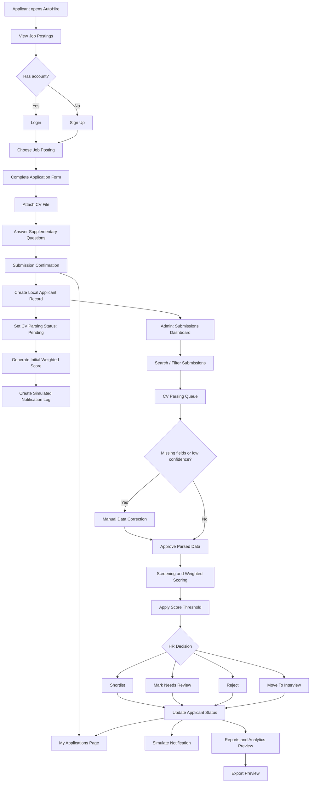

# AutoHire Architecture And Flow Diagrams

AutoHire is a Recruitment Management System with Applicant Screening. The current prototype is frontend-only: all screens, actions, scoring, notifications, reports, and data updates are simulated in the React UI with local mock TypeScript data.

## System Architecture

```mermaid
flowchart TB
  applicant["Applicant / User"]
  admin["HR / Admin"]

  subgraph frontend["Frontend Application: Next.js + React + TypeScript"]
    shell["App Shell and Navigation"]
    applicantPortal["Applicant Portal"]
    adminPortal["Admin Portal"]

    subgraph applicantModules["Applicant Modules"]
      jobsPage["Job Postings Page"]
      authPage["Login / Sign Up"]
      applicationForm["Application Form and CV Upload Simulation"]
      applicationStatus["My Applications Page"]
      accountPage["Account Page"]
    end

    subgraph adminModules["Admin Modules"]
      dashboard["Submissions Dashboard"]
      parsing["CV Parsing and Data Extraction"]
      screening["Screening and Weighted Scoring"]
      jobSetup["Job Posting Management"]
      notifications["Notifications"]
      reports["Reports and Analytics"]
      applicantDetail["Applicant Detail Review"]
    end
  end

  subgraph state["Local Prototype State"]
    applicants["Applicant[]"]
    users["UserAccount[]"]
    jobs["JobPosting[]"]
    parsedProfiles["ParsedProfile"]
    scores["CriterionScore[]"]
    templates["NotificationTemplate[]"]
    logs["NotificationLog[]"]
    filters["ReportFilter"]
  end

  subgraph outOfScope["Future Backend Services: Out Of Scope In V1"]
    auth["Real Authentication"]
    database["Database / Supabase"]
    storage["File Storage"]
    parser["CV Parser Engine"]
    email["Email Delivery"]
    exportService["Real Export Generation"]
  end

  applicant --> applicantPortal
  admin --> adminPortal

  shell --> applicantPortal
  shell --> adminPortal

  applicantPortal --> jobsPage
  applicantPortal --> authPage
  applicantPortal --> applicationForm
  applicantPortal --> applicationStatus
  applicantPortal --> accountPage

  adminPortal --> dashboard
  adminPortal --> parsing
  adminPortal --> screening
  adminPortal --> jobSetup
  adminPortal --> notifications
  adminPortal --> reports
  adminPortal --> applicantDetail

  jobsPage --> jobs
  applicationForm --> applicants
  applicationForm --> parsedProfiles
  applicationStatus --> applicants
  accountPage --> users

  dashboard --> applicants
  parsing --> parsedProfiles
  screening --> scores
  jobSetup --> jobs
  notifications --> templates
  notifications --> logs
  reports --> filters
  reports --> applicants

  applicants -. "future persistence" .-> database
  users -. "future auth" .-> auth
  applicationForm -. "future upload" .-> storage
  parsing -. "future extraction" .-> parser
  notifications -. "future sending" .-> email
  reports -. "future files" .-> exportService
```

## End-To-End System Flow

## Core Module Responsibilities

| Module | Responsibility |
| --- | --- |
| Job Postings | Shows active roles to applicants and manages posting criteria for admins. |
| Applicant Submission | Captures applicant details, CV upload simulation, and supplementary answers. |
| CV Parsing | Simulates parser states, missing-field warnings, manual correction, and approval. |
| Screening And Scoring | Applies weighted scoring: Skills 40%, Experience 30%, Education 20%, Certifications 10%. |
| Submissions Dashboard | Gives HR a focused queue for reviewing and filtering applicants. |
| Notifications | Simulates status-triggered message templates and delivery logs. |
| Reports And Analytics | Shows score/source summaries and export preview without generating real files. |

